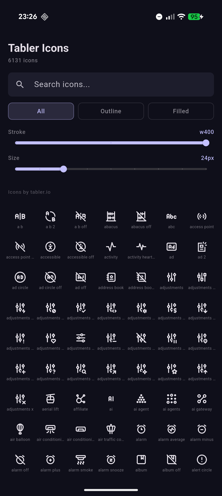
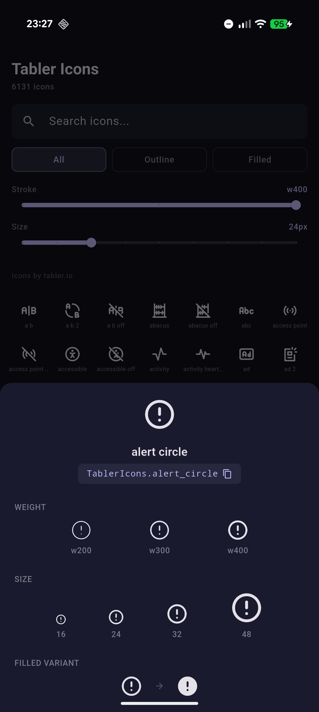
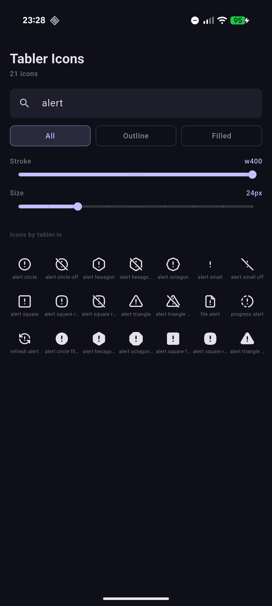
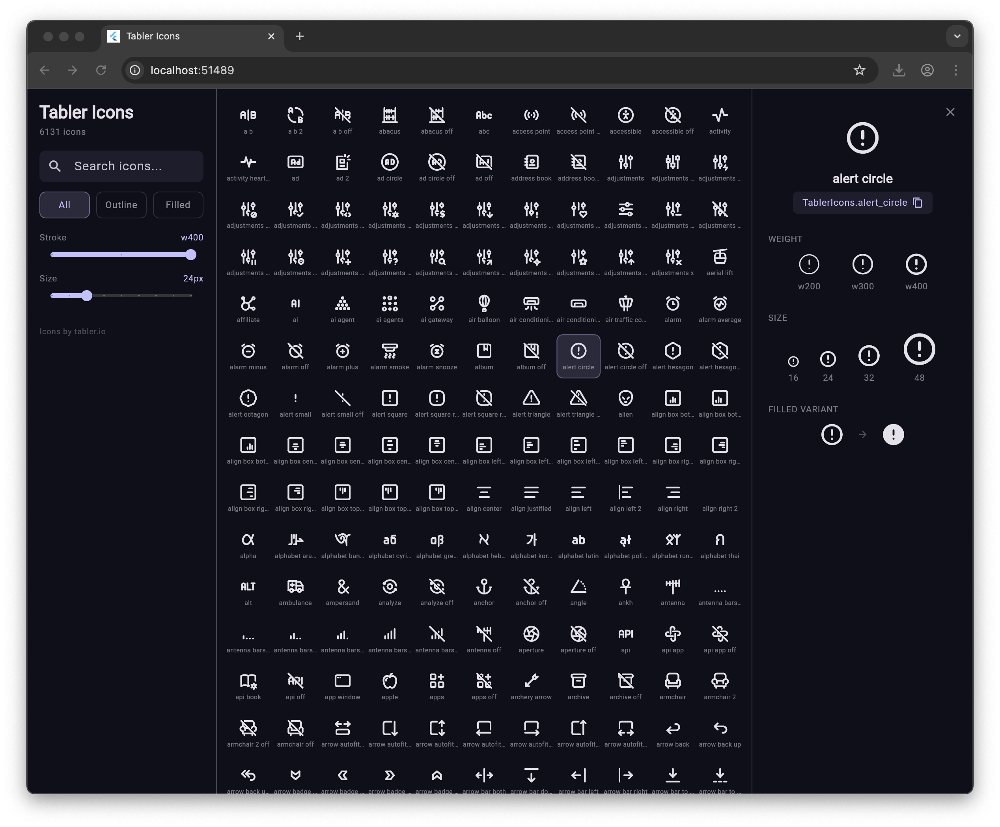

# flutter_tabler_icons

The [Tabler Icon Pack](https://github.com/tabler/tabler-icons) in Flutter

Tabler icons version: v3.40.0

## pubspec.yaml
```yml
dependencies:
  flutter:
    sdk: flutter
  flutter_tabler_icons: [latest]
```

## Usage
```Dart
import 'package:flutter_tabler_icons/flutter_tabler_icons.dart';

class MyWidget extends StatelessWidget {
  Widget build(BuildContext context) {
    return IconButton(
      icon: Icon(TablerIcons.alarm_smoke),
      onPressed: () { print('Alarm Smoke'); }
     );
  }
}
```

### Filled Icons
You can use the new filled versions of the icons by appending `_filled` to the icon name:
```Dart
Icon(TablerIcons.sparkles_filled)
```

### Stroke Widths
This package supports customizable stroke widths (weights) for the outline icons! However, because standard Flutter `Icon` widgets do not support static font weights properly, you **must use the included `TablerIcon` widget instead of `Icon`** to use lighter weights.

Supported weights:
- `FontWeight.w400` (Default, 2px stroke)
- `FontWeight.w300` (1.5px stroke)
- `FontWeight.w200` (1px stroke)

```Dart
// A thinner icon
TablerIcon(TablerIcons.home_2, weight: FontWeight.w200)

// You can also use IconTheme to apply it globally:
// IconThemeData(weight: 200)
// TablerIcon will automatically inherit from your Theme!
```

## Example App

The example app is a responsive icon browser that showcases all package features:

- **Search** — filter 6,000+ icons by name in real time
- **Filter tabs** — switch between All, Outline, and Filled icons
- **Stroke weight slider** — compare icons at w200, w300, and w400
- **Size slider** — preview icons from 16px to 48px (4dp increments)
- **Icon detail** — tap any icon to see weight comparison, size preview, usage code with copy-to-clipboard, and filled/outline counterpart
- **Responsive layout** — controls on top with bottom sheet on phones, sidebar with detail panel on tablets and desktop

### Mobile

| Icon Grid | Icon Detail | Search |
|-----------|-------------|--------|
|  |  |  |

### Desktop



## Updating Icons

This package can be updated to use a newer release of Tabler Icons with `tabler_gen.py` in `/util`. It takes the codepoints from the CSS file of the release and generates a Flutter class of all of the icons.

Example:
```bash
python3 ./util/tabler_gen.py -i ./util/node_modules/@tabler/icons-webfont/dist -o ./lib/flutter_tabler_icons.dart -to ./assets/fonts/tabler-icons.ttf
```

## Credits

Icons by [Tabler Icons](https://tabler.io/icons) by [Paweł Kuna](https://github.com/codecalm), licensed under the [MIT License](https://github.com/tabler/tabler-icons/blob/main/LICENSE).
